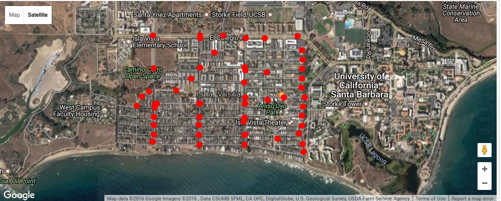
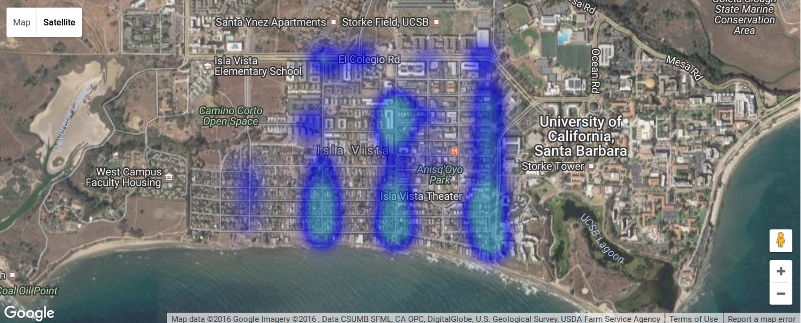
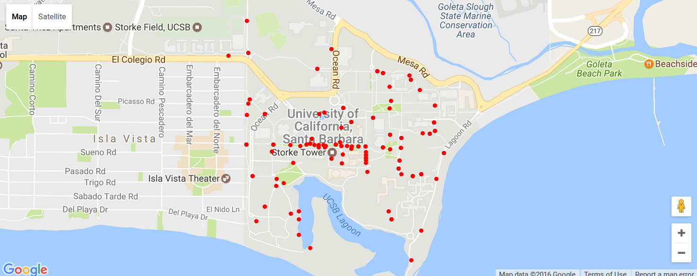
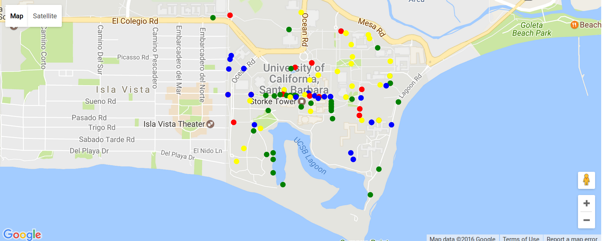

# Spatial Data using gmaps and Jupyter notebook 
We created this seperate notebook because we saw that the module `gmaps` works best at creating simple spatial data. This notebook is used to show the comparisons to **R** and **Python** 


```python
import gmaps
import gmaps.datasets
import pandas as pd
import numpy as np
gmaps.configure(api_key="")
```


```python
bikesStolen = pd.read_csv('testLongLat.csv', sep=',')
bikesStolen.head(7)
```


<div>
<table border="1" class="dataframe">
  <thead>
    <tr style="text-align: right;">
      <th></th>
      <th>Unnamed: 0</th>
      <th>Location</th>
      <th>fromDate</th>
      <th>toDate</th>
      <th>fromTime</th>
      <th>toTime</th>
      <th>Brand</th>
      <th>Model</th>
      <th>Speed</th>
      <th>Color</th>
      <th>lon</th>
      <th>lat</th>
      <th>count</th>
    </tr>
  </thead>
  <tbody>
    <tr>
      <th>0</th>
      <td>1</td>
      <td>1000 CAMINO PESCADERO</td>
      <td>2014-04-20</td>
      <td>2014-04-20</td>
      <td>900</td>
      <td>1200</td>
      <td>URBAN</td>
      <td>CRUISER</td>
      <td>1.0</td>
      <td>White</td>
      <td>-119.858706</td>
      <td>34.410469</td>
      <td>1</td>
    </tr>
    <tr>
      <th>1</th>
      <td>2</td>
      <td>1000 EL EMBARCADERO RD</td>
      <td>2011-03-08</td>
      <td>2011-03-08</td>
      <td>1630</td>
      <td>1930</td>
      <td>TREK</td>
      <td>ALLANT</td>
      <td>NaN</td>
      <td>Black</td>
      <td>-119.855947</td>
      <td>34.410216</td>
      <td>4</td>
    </tr>
    <tr>
      <th>2</th>
      <td>3</td>
      <td>1000 EL EMBARCADERO RD</td>
      <td>2011-06-10</td>
      <td>2011-06-20</td>
      <td>1500</td>
      <td>1000</td>
      <td>PFFRAN</td>
      <td>JULIUS</td>
      <td>1.0</td>
      <td>White</td>
      <td>-119.855947</td>
      <td>34.410216</td>
      <td>4</td>
    </tr>
    <tr>
      <th>3</th>
      <td>4</td>
      <td>1000 EL EMBARCADERO RD</td>
      <td>2012-08-04</td>
      <td>2012-08-05</td>
      <td>2230</td>
      <td>100</td>
      <td>RETROS</td>
      <td>58</td>
      <td>1.0</td>
      <td>Silver</td>
      <td>-119.855947</td>
      <td>34.410216</td>
      <td>4</td>
    </tr>
    <tr>
      <th>4</th>
      <td>5</td>
      <td>1000 EL EMBARCADERO RD</td>
      <td>2012-08-04</td>
      <td>2012-08-05</td>
      <td>2230</td>
      <td>100</td>
      <td>NaN</td>
      <td>NaN</td>
      <td>1.0</td>
      <td>Black</td>
      <td>-119.855947</td>
      <td>34.410216</td>
      <td>4</td>
    </tr>
    <tr>
      <th>5</th>
      <td>6</td>
      <td>6500 CERVANTES RD</td>
      <td>2011-10-22</td>
      <td>2011-10-24</td>
      <td>30</td>
      <td>1230</td>
      <td>K2</td>
      <td>ZED 2.0</td>
      <td>21.0</td>
      <td>Grey</td>
      <td>-119.853841</td>
      <td>34.416421</td>
      <td>4</td>
    </tr>
    <tr>
      <th>6</th>
      <td>7</td>
      <td>6500 CERVANTES RD</td>
      <td>2012-03-23</td>
      <td>2012-09-23</td>
      <td>900</td>
      <td>900</td>
      <td>JEEP</td>
      <td>CHEROKEE</td>
      <td>12.0</td>
      <td>Red</td>
      <td>-119.853841</td>
      <td>34.416421</td>
      <td>4</td>
    </tr>
  </tbody>
</table>
</div>


## Data Wrangling

For this section we are only interesting in Spatial data (we went ahead and did data wrangling in the actual script, but to show the immediate results that makes sense and straightforward


```python
spatData = bikesStolen[['lat', 'lon']] # Here we extract the latitude and longitude
print("Showing the amount of missing values:")
print(spatData.tail(44))
# We should remove all these null values first 
spatData = spatData.dropna()
print("We print the tail of the data frame to show that the NaN's were removed:")
print(spatData.tail(10))

tuples = [tuple(x) for x in spatData.values] # Used to convert the data frame into a tuple
print("Show the newly converted tuple")
print(tuples[1:10])
```

    Showing the amount of missing values:
         lat  lon
    896  NaN  NaN
    897  NaN  NaN
    898  NaN  NaN
    899  NaN  NaN
    900  NaN  NaN
    901  NaN  NaN
    902  NaN  NaN
    903  NaN  NaN
    904  NaN  NaN
    905  NaN  NaN
    906  NaN  NaN
    907  NaN  NaN
    908  NaN  NaN
    909  NaN  NaN
    910  NaN  NaN
    911  NaN  NaN
    912  NaN  NaN
    913  NaN  NaN
    914  NaN  NaN
    915  NaN  NaN
    916  NaN  NaN
    917  NaN  NaN
    918  NaN  NaN
    919  NaN  NaN
    920  NaN  NaN
    921  NaN  NaN
    922  NaN  NaN
    923  NaN  NaN
    924  NaN  NaN
    925  NaN  NaN
    926  NaN  NaN
    927  NaN  NaN
    928  NaN  NaN
    929  NaN  NaN
    930  NaN  NaN
    931  NaN  NaN
    932  NaN  NaN
    933  NaN  NaN
    934  NaN  NaN
    935  NaN  NaN
    936  NaN  NaN
    937  NaN  NaN
    938  NaN  NaN
    939  NaN  NaN
    We print the tail of the data frame to show that the NaN's were removed:
               lat         lon
    625  34.411696 -119.862616
    626  34.411696 -119.862616
    627  34.411696 -119.862616
    628  34.411696 -119.862616
    629  34.411696 -119.862616
    630  34.411696 -119.862616
    631  34.411696 -119.862616
    632  34.411696 -119.862616
    633  34.411696 -119.862616
    635  34.411696 -119.862616
    Show the newly converted tuple
    [(34.410215999999998, -119.855947), (34.410215999999998, -119.855947), (34.410215999999998, -119.855947), (34.410215999999998, -119.855947), (34.416421100000001, -119.85384140000001), (34.416421100000001, -119.85384140000001), (34.416421100000001, -119.85384140000001), (34.416421100000001, -119.85384140000001), (34.4137755, -119.85388500000001)]


## Representing Spatial Data


```python
tuples_layer = gmaps.symbol_layer(
    tuples, fill_color="red", stroke_color="red", scale=3
)
r = gmaps.Map()
r.add_layer(tuples_layer)
r
```



Gives us a decent overview but we felt as though heatmaps would do better at representing our data. 

## Heatmap


```python
m = gmaps.Map()
heatmap_layer = gmaps.Heatmap(data=tuples)
m.add_layer(heatmap_layer)
m
```




```python
# Adding A E S T H E T I C S
# Was recommended to add in a seperate cell so we won't have to constant call google API everytime we want to 
# customize the plots
heatmap_layer.max_intensity = 50
heatmap_layer.point_radius = 50
heatmap_layer.gradient = [
    (200, 200, 200, 0.3),
    'blue',
    '#3299CC'
]
```

## Plotting more bicycle related data

This data set was compiled by Kevin Jin and as attributes such as dangerous spots to ride bike in within the University of California, Santa Barbara.


```python
data = pd.read_csv('BikenBlast.csv', sep=',')
data.head()
```


<div>
<table border="1" class="dataframe">
  <thead>
    <tr style="text-align: right;">
      <th></th>
      <th>Description</th>
      <th>Latitude</th>
      <th>Longitude</th>
    </tr>
  </thead>
  <tbody>
    <tr>
      <th>0</th>
      <td>dangSpot</td>
      <td>34.417634</td>
      <td>-119.853439</td>
    </tr>
    <tr>
      <th>1</th>
      <td>dangSpot</td>
      <td>34.417634</td>
      <td>-119.853439</td>
    </tr>
    <tr>
      <th>2</th>
      <td>dangSpot</td>
      <td>34.413042</td>
      <td>-119.853583</td>
    </tr>
    <tr>
      <th>3</th>
      <td>dangSpot</td>
      <td>34.413042</td>
      <td>-119.853583</td>
    </tr>
    <tr>
      <th>4</th>
      <td>dangSpot</td>
      <td>34.413042</td>
      <td>-119.853583</td>
    </tr>
  </tbody>
</table>
</div>


```python
# Create a tuple for the latitude and longitude
bikeNBlast = data[['Latitude', 'Longitude']]
bikeNBlastTuples = [tuple(x) for x in bikeNBlast.values]
bikeNBlastTuples[1:10]
```


    [(34.417634, -119.85343899999999),
     (34.413041999999997, -119.853583),
     (34.413041999999997, -119.853583),
     (34.413041999999997, -119.853583),
     (34.411425999999999, -119.85318500000001),
     (34.411425999999999, -119.85318500000001),
     (34.413027, -119.85196100000002),
     (34.413027, -119.85196100000002),
     (34.413027, -119.85196100000002)]


tuples_layer2 = gmaps.symbol_layer(
    bikeNBlastTuples, fill_color="red", stroke_color="red", scale=2
)
s = gmaps.Map()
s.add_layer(tuples_layer2)
s



## Specifying Description to Color Code Plot


```python
# Again a for loop would reduce code significantly
dangerSpot = data[data['Description'] == 'dangSpot']
dangerSpot = dangerSpot[['Latitude', 'Longitude']]
dangerSpotTuple = [tuple(x) for x in dangerSpot.values]
print("Dangerous Spots:")
print(dangerSpotTuple[1:10])

smallObst = data[data['Description'] == 'smallObst']
smallObst = smallObst[['Latitude', 'Longitude']]
smallObstTuple = [tuple(x) for x in smallObst.values]
print("Small Obstructions:")
print(smallObstTuple[1:10])

goodSpot = data[data['Description'] == 'goodSpot']
goodSpot = goodSpot[['Latitude', 'Longitude']]
goodSpotTuple = [tuple(x) for x in goodSpot.values]
print("Good Spots:")
print(goodSpotTuple[1:10])

moreRack = data[data['Description'] == 'moreRack']
moreRack = moreRack[['Latitude', 'Longitude']]
moreRackTuple = [tuple(x) for x in moreRack.values]
print("More Racks:")
print(moreRackTuple[1:10])
```

    Dangerous Spots:
    [(34.417634, -119.85343899999999), (34.413041999999997, -119.853583), (34.413041999999997, -119.853583), (34.413041999999997, -119.853583), (34.411425999999999, -119.85318500000001), (34.411425999999999, -119.85318500000001), (34.413027, -119.85196100000002), (34.413027, -119.85196100000002), (34.413027, -119.85196100000002)]
    Small Obstructions:
    [(34.415083000000003, -119.85346499999999), (34.414512999999999, -119.85355800000001), (34.413041999999997, -119.853583), (34.411301000000002, -119.851743), (34.414547999999996, -119.852474), (34.414547999999996, -119.852474), (34.414547999999996, -119.852474), (34.414547999999996, -119.852474), (34.413027, -119.85196100000002)]
    Good Spots:
    [(34.417501999999999, -119.85465900000001), (34.410928999999996, -119.851803), (34.409680000000002, -119.85041299999999), (34.409295, -119.850424), (34.409560999999997, -119.85089599999999), (34.408498999999999, -119.850424), (34.407826, -119.84971100000001), (34.413004999999998, -119.85091499999999), (34.412951, -119.85030800000001)]
    More Racks:
    [(34.409905999999999, -119.85246799999999), (34.409905999999999, -119.85246799999999), (34.409179999999999, -119.852999), (34.412671000000003, -119.85204399999999), (34.412671000000003, -119.85204399999999), (34.412907000000004, -119.849222), (34.413327000000002, -119.849622), (34.413052, -119.84819099999999), (34.413052, -119.84819099999999)]


```python
tuples_layerA = gmaps.symbol_layer(
    dangerSpotTuple, fill_color="red", stroke_color="red", scale=3
)

tuples_layerB = gmaps.symbol_layer(
    smallObstTuple, fill_color="blue", stroke_color="blue", scale=3
)

tuples_layerC = gmaps.symbol_layer(
    goodSpotTuple, fill_color="green", stroke_color="green", scale=3
)

tuples_layerD = gmaps.symbol_layer(
    moreRackTuple, fill_color="yellow", stroke_color="yellow", scale=3
)
t = gmaps.Map()
t.add_layer(tuples_layerA)
t.add_layer(tuples_layerB)
t.add_layer(tuples_layerC)
t.add_layer(tuples_layerD)
t
```



#### Legend
| Descripton | Color |
|------------|-------|
| Dangerous Spots | Red |
| Small Obstructions | Blue | 
| Good Spot | Green |
| Bicycle Racks | Yellow |

## What's next
We can create plots for the specific years like we did in the spatialData (found here: http://staging.inertia7.com/projects/bikes-stolen-isla-vista)

I want to create a comparison of the capabilities between **R** and **Python**

